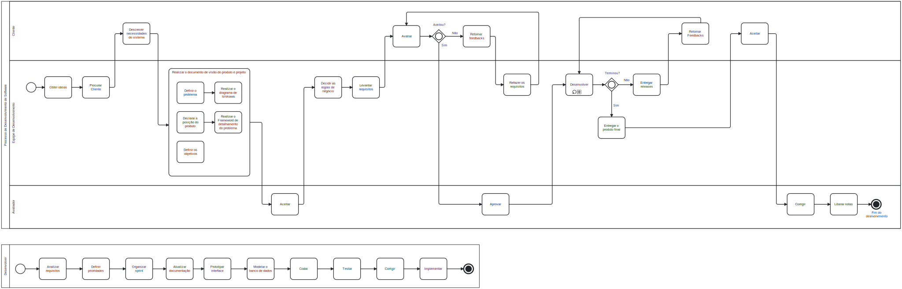

# Modelagem de processo - MedManager

O diagrama a seguir representa a modelagem de processos utilizada para o gerenciamento do backlog do projeto. Ele foi elaborado com base nas práticas de BPMN (Business Process Model and Notation) para descrever de forma clara e padronizada as atividades envolvidas no ciclo de vida do produto.

Esse modelo promove uma visão ampla do projeto.

