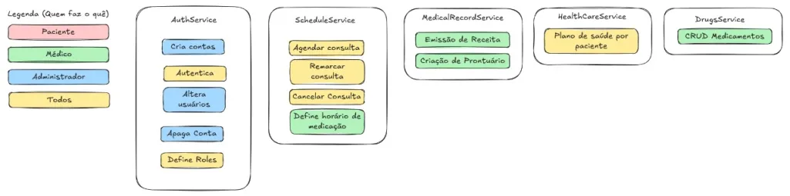

# 🏥 A Arquitetura de Microserviços no MedManager  

Ao levantar todas as funcionalidades desejadas para o software, nos deparamos com uma lista extensa e complexa, o que poderia resultar em uma aplicação monolítica difícil de manter e escalar. Para evitar essa "maçaroca" de código, onde diversos serviços se acoplam de maneira excessiva, gerando alta complexidade na solução de problemas, optamos por uma abordagem mais moderna e eficiente: **a Arquitetura de Microserviços**.  

Essa arquitetura nos permite segmentar cada funcionalidade do sistema em serviços independentes, garantindo maior modularidade, escalabilidade e facilidade na manutenção. Dessa forma, o **MedManager** se torna um sistema robusto e preparado para crescer sem aumentar proporcionalmente os custos operacionais.  

Na Arquitetura de Microserviços, cada serviço opera com **o mínimo possível de dependência de outros serviços**. Por exemplo, se um usuário não conseguir recuperar sua senha no sistema de autenticação, isso **não impactará** a realização de consultas, o recebimento de notificações ou o acesso a prontuários. Apenas duas aplicações são essenciais para o funcionamento global do sistema:  
1. **O Frontend**, que fornece a interface para os usuários.  
2. **O API Gateway**, que direciona cada requisição ao serviço correto.  

## 🏗️ Estrutura do MedManager  

O diagrama abaixo ilustra como cada serviço opera dentro dessa arquitetura:

### 📌 AuthService (Serviço de Autenticação)  
🔹 Responsável por gerenciar usuários e garantir a segurança do acesso.  
- 🟡 **Criar contas** (**Todos**)  
- 🟡 **Autenticar usuários** (**Todos**)  
- 🟡 **Alterar informações de usuários** (**Administrador**)  
- 🔵 **Apagar contas** (**Administrador**)  
- 🔵 **Definir permissões e papéis de usuários** (**Administrador**)  

### 📌 ScheduleService (Serviço de Agendamento)  
🔹 Controla todas as operações relacionadas a consultas médicas e horários de medicação.  
- 🟠 **Agendar consultas** (**Paciente**)  
- 🟠 **Remarcar consultas** (**Paciente**)  
- 🟠 **Cancelar consultas** (**Paciente**)  
- 🟢 **Definir horários de medicação** (**Médico**)  

### 📌 MedicalRecordService (Serviço de Prontuários)  
🔹 Garante o armazenamento e acesso a informações médicas dos pacientes.  
- 🟢 **Emissão de receitas médicas** (**Médico**)  
- 🟢 **Criação de prontuários médicos** (**Médico**)  

### 📌 HealthCareService (Serviço de Gestão de Planos de Saúde)  
🔹 Permite o gerenciamento de planos de saúde para os pacientes.  
- 🟠 **Associar plano de saúde por paciente** (**Paciente**)  

### 📌 DrugsService (Serviço de Medicamentos)  
🔹 Gerencia informações sobre medicamentos cadastrados no sistema.  
- 🟢 **CRUD (Criar, Ler, Atualizar e Deletar) de medicamentos** (**Médico**)  

---

## 🌟 Benefícios da Arquitetura de Microserviços  
✔ **Modularidade** → Cada serviço pode ser desenvolvido, testado e implantado separadamente.  
✔ **Escalabilidade** → Podemos aumentar os recursos apenas dos serviços mais demandados.  
✔ **Resiliência** → Falhas em um serviço não impactam o funcionamento dos demais.  
✔ **Facilidade de manutenção** → Permite atualizações e correções de bugs de forma mais ágil.  

Com essa estrutura bem definida, o **MedManager** se torna uma plataforma altamente eficiente para a gestão de consultas médicas, garantindo um fluxo organizado para pacientes, médicos e administradores. 🚀  

