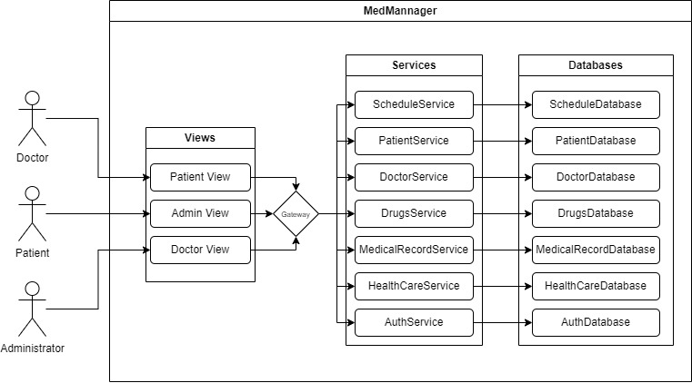

# Arquitetura

Ao levantar todas as funcionalidades desejadas para o software nos deparamos com uma lista que a priore parece extensa, complexa e que nos levaria a criação de uma 
"maçaroca" de código com diversos serviços se acoplando um ao outro e gerando uma complexidade alta para solução de problemas que podem e irão surgir posteriormente.

Para tornar o processo de desenvolvimento de cada parte o mais segmentado possível, tornar o MedManager um sistema robusto, que pode ser escalado sem também escalar
os custos necessários, optamos por uma arquitetura que nos permite realizar essa segmentação já de antemão e que vai permitir escalar apenas o necessário: a Arquitetura de Microserviços.

Nessa arquitetura cada um dos serviços funciona com o mínimo possível de dependência em outros serviços. Ou seja, se um usuário não consegue recuperar sua senha nada irá impedir que
usuários já logados consigam marcar uma consulta, receber eventos no calendário ou acessar um prontuário. Dessa forma, apenas 2 aplicações fariam com que todo o sistema deixasse de funcionar 
em caso de queda, o front-end e o API Gateway responsável por redirecionar cada requisão ao seu devido serviço.

O diagrama abaixo mostra como cada parte se comunica dentro desse padrão arquitetural: 

