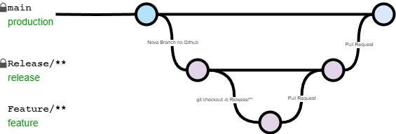

# Branch Strategy

Para manter a organização do repositório a equipe optou por uma estratégia de organização de branches simples mas efetiva composta por 3 tipos de branches



## Branches do repositório

### main
Branch principal do projeto onde ficarão os arquivos do ambiente de produção.
A branch é protegida contra commits e pushes e só receberá atualizações por meio de Pull Requests que passagem pela avaliação de pelo menos mais 1 membro.

:::warning

**É terminantemente proibido pushes direto na main branch!**

:::

### Release/[nome da release]

Branch do ambiente de testes da aplicação. Ela é protegida contra commits e pushes diretos e só receberá atualizações por meio de Pull Request que passarem pela avaliação de mais 1 membro.

:::warning

É proibido criar uma branch de release com base em uma branch de Feature para pular etapas. Criar a Release somente a partir da main!

:::

### Feature/[nome da feature]

Branch de trabalho. Nela são permitidos commits e pushes direto para o repositório

## Fluxo de trabalho

Ao início de uma nova release deve ser criada uma nova branch de Release no Github. Esse processo só precisa ser feito uma vez por release, sendo necessária apenas uma branch desse tipo a cada cíclo.

Após o início do novo cíclo seguir o seguinte fluxo de trabalho:

```sh
$ git pull origin Release/[nome da release]
$ git checkout Release/[nome da release]
$ git checkout -b Feature/[nome da feature]
$ git add [seus arquivos modificados]
$ git commit -m "tipo de commit: o que foi feito"
$
$ #caso seja seu primeiro commit para o repositório remoto
$ git push --set-up-stream origin [sua branch]
$
$ #caso já tenha definido a up-stream
$ git push
```


